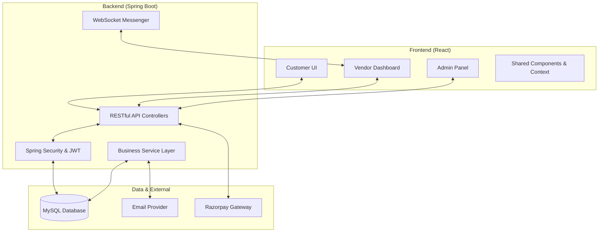

# FoodDash - Premium Multi-Role Food Delivery Ecosystem 🚀

Welcome to **FoodDash**, a state-of-the-art, full-stack food delivery platform designed for speed, elegance, and reliability. This project isn't just a simple app; it's a comprehensive ecosystem that connects hungry customers, passionate vendors, and platform administrators through a seamless, real-time interface.

---

## 📑 Table of Contents
1. [Introduction](#introduction)
2. [High-Level System Architecture](#high-level-system-architecture)
3. [Deep Dive: User Experience (Customer Panel)](#deep-dive-user-experience-customer-panel)
4. [Deep Dive: Vendor Operations (Seller Panel)](#deep-dive-vendor-operations-seller-panel)
5. [Deep Dive: Administrative Control (Super Admin)](#deep-dive-administrative-control-super-admin)
6. [Technical Excellence & Implementation](#technical-excellence--implementation)
7. [Backend Engineering (Spring Boot)](#backend-engineering-spring-boot)
8. [Frontend Mastery (React)](#frontend-mastery-react)
9. [Deployment & Setup Guide](#deployment--setup-guide)

---

## 🌟 Introduction

**FoodDash** is built to solve the modern challenges of food delivery by providing a "Premium" experience. Unlike traditional boilerplate projects, FoodDash focuses on:
- **Rich Aesthetics**: Glassmorphism, fluid animations, and a system-wide Dark/Light mode.
- **Role Precision**: Distinct permissions and dashboards for Users, Vendors, and Admins.
- **Enterprise Ready**: Integrated with **Razorpay** for payments, **WebSockets** for live updates, and **JWT** for military-grade security.

---

## 🏗️ High-Level System Architecture

The following diagram illustrates how the various layers of the FoodDash ecosystem interact:

---

## 🍱 Deep Dive: User Experience (Customer Panel)

The customer panel is designed for **discovery and instant gratification**.

### 1. Smart Restaurant Discovery
- **Live Search & Filter**: Users can search for specific dishes or restaurants. The backend filters through thousands of items in milliseconds.
- **Categorical Browsing**: Dynamic categories (Pizza, Biryani, Burgers) allow for tactile, horizontal-scroll exploration.
- **Real-time Availability**: Items are marked as "Not Available" instantly if the vendor toggles them off.

### 2. Premium Checkout & Payments
- **Glassmorphism Cart**: A floating, transparent cart that updates totals (including taxes and delivery fees) in real-time.
- **Razorpay Integration**: A secure, industrial-standard payment gateway. We implement **dynamic pre-filling**, so the user's name, email, and phone number are automatically sent to the payment window, reducing friction.

### 3. Post-Purchase Magic
- **Order History & Invoicing**: A beautiful history page where users can view past orders, track current ones, and download **professional PDF-style receipts** via the `InvoiceModal`.
- **One-Click Reorder**: Found something you loved? One click puts the same items back in your cart and initiates checkout.
- **Reviews & Ratings**: Share your experience. These ratings aggregate into the restaurant's overall score, influencing its rank in the discovery list.

---

## 🏪 Deep Dive: Vendor Operations (Seller Panel)

The vendor dashboard is a high-performance **command center**.

### 1. Real-time Menu Management
- Vendors have full control over their digital storefront via the `ItemManager`.
- **Dynamic Pricing**: Update prices instantly.
- **Availability Toggle**: Disable items that are out of stock to prevent customer disappointment.

### 2. Live Order Lifecycle
- **WebSocket Notifications**: New orders pop up instantly as "Toast" notifications (even if the vendor is on another tab), complete with a notification sound.
- **Status Progression**: A structured flow: `PENDING` -> `CONFIRMED` -> `PREPARING` -> `READY` -> `DELIVERED`. Each flip of the status notifies the customer in real-time.

### 3. Visual Analytics Dashboard
- **SVG-Powered Charts**: Vendors can track their success through `VendorAnalytics`.
- **Daily Earnings Trend**: A line graph showing revenue growth over time.
- **Order distribution**: Pie charts showing top-performing categories or status breakdowns.

---

## 🛡️ Deep Dive: Administrative Control (Super Admin)

The "Brain" of the platform, where trust and quality are maintained.

### 1. Vendor Onboarding & Approval
- Anyone can register as a vendor, but they remain "Inactive" until checked by an Admin.
- Admins can review business details and "Approve" vendors to go live on the platform.

### 2. User & Content Moderation
- **User Management**: Admins can block/unblock users to maintain a safe community.
- **Global View**: A unique "God Mode" toggle in the dashboard that allows Admins to see all orders occurring across the entire platform in real-time.

---

## 🛠️ Technical Excellence & Implementation

### 1. Security (Spring Security + JWT)
- We use **JSON Web Tokens (JWT)** for stateless authentication.
- **Role-Based Access Control (RBAC)**: Custom filters ensure a Vendor can never see Admin data, and a User can never manipulate Vendor menus.

### 2. Database Design (JPA/Hibernate)
- **Relational Integrity**: Complex relationships between Users, Vendors, Orders, and OrderItems are handled via Hibernate.
- **Performance**: We use indexed fields and `FETCH JOIN` queries in the `OrderRepository` to avoid N+1 performance bottlenecks.

### 3. State Management (React Context)
- **ThemeContext**: Manages the global look and feel (Light/Dark mode) without page reloads.
- **NotificationContext**: A centralized system to push "Success" or "Error" notifications to users from any component.

---

## 📦 Backend Engineering (Spring Boot)

The backend is organized into a clean, modular structure:
- **Controllers**: Entry points for the API (e.g., `OrderController`).
- **Services**: The business logic (e.g., `OrderService` handles the complex math of order creation and notification).
- **Repositories**: Direct interaction with the MySQL database via Spring Data JPA.
- **Entities**: Java representations of our database tables (User, Item, Order, etc.).

---

## 🎨 Frontend Mastery (React)

The frontend is a masterclass in **Vanilla CSS & Modular Design**:
- **Zero Heavy Frameworks**: We use pure CSS for the design system (`index.css`), showcasing deep control over HSL colors, variables, and glassmorphism logic.
- **Lucide Icons**: High-quality, vector-based iconography for a modern look.
- **Custom Hooks**: `useWebSocket.js` encapsulates the logic for real-time order listening, making components clean and readable.

---

## 🚀 Deployment & Setup Guide

### 1. Backend Setup
1. Ensure **MySQL** is running. Create a database: `CREATE DATABASE fooddash_db;`.
2. Open `src/main/resources/application.properties`.
3. Update `spring.datasource.username` and `password`.
4. Run the app: `./mvnw spring-boot:run`. (Initial data will be seeded automatically by `DataInitializer`).

### 2. Frontend Setup
1. Navigate to the `frontend` directory.
2. Install dependencies: `npm install`.
3. Start the dev server: `npm start`.

### 3. Environment Variables
For production, ensure you set:
- `REACT_APP_RAZORPAY_KEY_ID`: Your Razorpay API Key.
- `JWT_SECRET`: A strong secret for token generation.

---

## 🛣️ Future Roadmap
- **iOS/Android Apps**: Bringing the React experience to mobile via React Native.
- **AI Recommendations**: Using order history to suggest new restaurants to users.
- **Delivery Partner App**: A fourth role specifically for delivery riders with real-time GPS tracking.

---
*FoodDash: Redefining the flavor of food delivery.*
*Implemented with ❤️ by the FoodDash Dev Team.*
